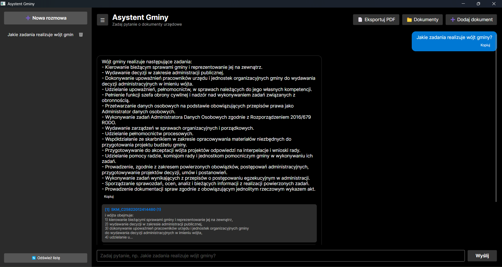
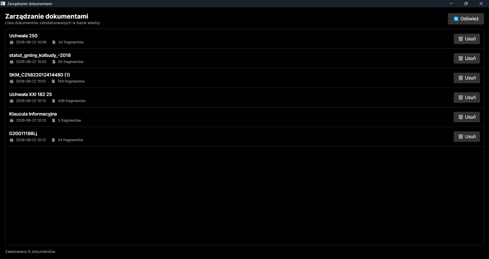

# Asystent Gminy

Lokalny asystent AI dla pracowników Urzędu Gminy. Odpowiada na pytania 
o dokumenty urzędowe (uchwały, regulaminy, ustawy) w języku naturalnym,
cytując źródła. **Wszystkie dane pozostają na serwerze urzędu** – żadne 
informacje nie są wysyłane do chmury.

## 📸 Zrzuty ekranu

### Główne okno – pytanie i odpowiedź z cytowaniem źródeł

*Asystent odpowiada na pytanie o zadania wójta gminy, cytując konkretne fragmenty dokumentów źródłowych.*

### Panel administracyjny – zarządzanie bazą wiedzy

*Panel administracyjny umożliwia przeglądanie i usuwanie dokumentów z bazy wiedzy.*

---

## ✨ Funkcje

- 💬 **Czat w języku naturalnym** – pytania po polsku, odpowiedzi po polsku
- 📚 **Odpowiedzi oparte na dokumentach** – model nie zmyśla, cytuje źródła
- 🔍 **Wyszukiwanie semantyczne** – rozumie sens pytania, nie tylko słowa
- 📄 **Obsługa PDF i skanów** – OCR (Tesseract) dla dokumentów bez warstwy tekstowej
- 🖥️ **Aplikacja desktopowa** – Avalonia 12, działa na Windows/Linux/macOS
- 🔒 **W 100% lokalnie** – Ollama + Bielik, brak połączenia z internetem
- 🌙 **Tryb ciemny/jasny** – automatyczne dopasowanie do systemu

---

## 🏗️ Architektura

Aplikacja desktop (Avalonia) komunikuje się przez HTTP z API (ASP.NET Core),
które korzysta z bazy PostgreSQL + pgvector oraz lokalnego modelu Bielik
uruchomionego przez Ollamę. Wszystko działa on-premise.

### Stack technologiczny

| Warstwa | Technologia | Wersja |
|---|---|---|
| UI desktop | Avalonia + CommunityToolkit.Mvvm | 12.1.2 |
| API | ASP.NET Core (Minimal API) + Scalar | .NET 10 |
| Baza danych | PostgreSQL + pgvector | 18.6 / 0.8.6 |
| ORM | Entity Framework Core + Pgvector.EntityFrameworkCore | 10.0 |
| LLM | Ollama + Bielik (SpeakLeash) | 4.5B / 11B |
| Embeddingi | nomic-embed-text-v2-moe | – |
| OCR | Tesseract + PDFtoImage | 5.5.2 |
| PDF | PdfOxide | – |

---

## 🚀 Szybki start

### Wymagania

- Windows 10/11, Linux lub macOS
- .NET 10 SDK
- Docker Desktop (dla PostgreSQL)
- Ollama
- 16 GB RAM (minimum), 32 GB zalecane
- Karta graficzna z 8+ GB VRAM (opcjonalnie – przyspiesza LLM)

### 1. Baza danych

Uruchom kontener PostgreSQL z pgvector:

    docker run -d --name pg-asystent --restart unless-stopped -e POSTGRES_PASSWORD=mojehaslo -p 5432:5432 pgvector/pgvector:pg18

Nastepnie utworz baze i aktywuj rozszerzenie w psql:

    CREATE DATABASE asystent_gminy;
    \c asystent_gminy
    CREATE EXTENSION vector;

### 2. Modele AI

    ollama pull nomic-embed-text-v2-moe
    ollama pull SpeakLeash/bielik-minitron-7B-v3.0-instruct:Q4_K_M

### 3. Ingestion – zaindeksuj dokumenty

Umiesc pliki PDF w katalogu knowledge_base, nastepnie uruchom:

    cd AsystentGminy.Ingestion
    dotnet run

### 4. Uruchom API

    cd AsystentGminy.Api
    dotnet run

Dokumentacja API dostepna pod adresem https://localhost:PORT/scalar

### 5. Uruchom aplikacje desktop

    cd AsystentGminy.Desktop
    dotnet run

---

## 📁 Struktura projektu

    AsystentGminy/
    ├── AsystentGminy.Desktop/    # Aplikacja desktop (Avalonia)
    ├── AsystentGminy.Api/        # Backend API (ASP.NET Core)
    ├── AsystentGminy.Ingestion/  # Indeksowanie dokumentow
    ├── knowledge_base/           # Dokumenty do zaindeksowania (PDF)
    ├── README.md                 # Ten plik
    ├── SECURITY.md               # Analiza bezpieczenstwa i RODO
    ├── INSTALL.md                # Instrukcja wdrozenia w urzedzie
    └── USER_GUIDE.md             # Instrukcja dla pracownikow

---

## 📖 Dokumentacja

- SECURITY.md – bezpieczenstwo i zgodnosc z RODO
- INSTALL.md – wdrozenie krok po kroku
- USER_GUIDE.md – instrukcja dla uzytkownikow

---

## 🎯 Status projektu

- ✅ Faza 1: Ingestion (PDF → wektory) – zakonczona
- ✅ Faza 2: API RAG (pytanie → odpowiedz) – zakonczona
- ✅ Faza 3: UI Avalonia – zakonczona
- 🔄 Faza 4: Wdrozenie w urzedzie – w toku

---

## 📝 Licencja

Projekt wewnetrzny – do uzytku w jednostkach samorzadu terytorialnego.

## 👤 Autor

Marcin Orłowski
